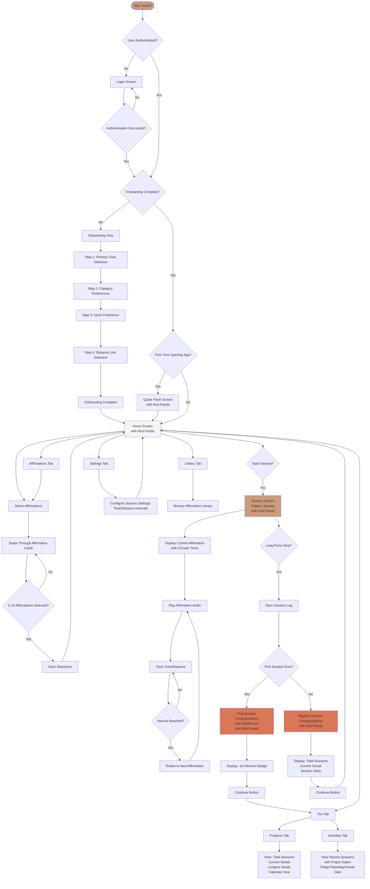

# User Flow Chart

This document outlines the complete user journey through the Mental Victory Practice app.

## Key User Paths

### First-Time User Path
1. App Launch → Login → Onboarding (4 steps) → Quote Flash → Home
2. Select 5-10 Affirmations → Start Session → Complete Session → First Congratulations → You Tab

### Returning User Path
1. App Launch → Home (no quote flash)
2. Start Session → Complete Session → Regular Congratulations → Home

### Session Flow
1. Start Session → Display Affirmation with Circular Timer
2. Play Affirmation Audio → Track Time/Distance
3. When Interval Reached → Rotate to Next Affirmation → Repeat
4. Long Press Stop → Save Session → Show Appropriate Congratulations Screen

## Screen Components

### Session Screen Features
- Red Panda image at top
- Current affirmation display
- Circular progress timer around affirmation (shows time until next affirmation)
- Real-time stats: Time, Distance (if enabled), Affirmations count
- Long-press stop button

### Congratulations Screens
- **First Session**: Medal icon, "1st Session" badge, special messaging, Red Panda
- **Regular Sessions**: Total sessions count, current streak, session stats, Red Panda

### Navigation Tabs
- **Home**: Main screen with session controls
- **Affirmations**: Select and manage affirmations
- **You**: Progress and Activities sub-tabs
- **Settings**: Configure session preferences
- **Library**: Browse affirmation library (if implemented)

